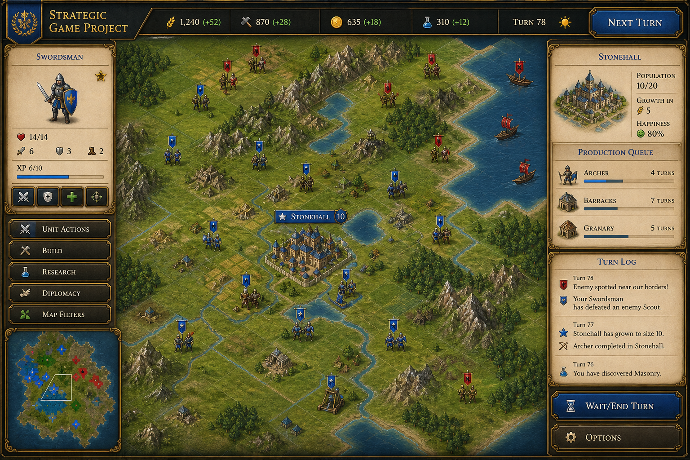

# Version 0.1 Visual Reset Plan

## Purpose

This document defines the visual reset direction for Issue #1.

Strategic Game Project should feel like a 2026 remake of a readable 1990s turn-based strategy interface: map-first, clear, calm, and playable. The gameplay should stay old-school and simple, while the code and visual finish should feel modern.

## Reference Boundary

Local Civilization II files may be studied only for structure and readability principles. They are intentionally listed as local reference filenames, not repo links:

- `Civilization_2/CIV2/TERRAIN1.GIF`
- `Civilization_2/CIV2/UNITS.GIF`
- `Civilization_2/CIV2/CITY.GIF`

Do not copy, import, crop, trace, recolor, or recreate these original assets. They are reference material for design logic only.

Use them to understand:

- how small terrain tiles remain readable
- how units stand out from terrain
- how cities feel important on the map
- how framed panels organize information simply
- how the map remains the main focus
- how player-facing maps avoid debug text
- how active unit and turn flow stay clear

## Product Direction

This is not a Civilization II clone.

The game should become its own small strategy game, combining these design inspirations:

- Civilization / Civilization II: turn-based empire flow, founding cities, terrain yields, simple production
- Colonization: frontier settlement feeling, resource-location pressure, discovering new land
- Age of Empires: readable buildings, strong resource locations, clear unit silhouettes
- Warcraft: stronger faction readability and more memorable units

The result should be original: custom terrain visuals, custom unit language, custom panels, and a distinct Strategic Game Project identity.

## Visual Principles

1. Map first.
   The map should take visual priority over panels. Panels support the turn, not dominate it.

2. No player-facing debug feel.
   Coordinates and tile yields stay hidden by default and only appear in debug mode.

3. Terrain must read instantly.
   Grassland should feel fertile, forest should feel dense, hills should feel rough, mountains should feel like barriers, and water should clearly separate from land.

4. Cities are important.
   A city should be larger and more visually anchored than a unit. Its label should attach to the city on the map.

5. Units need readable identity.
   Settler, Scout, and Warrior should differ by shape, stance, and label treatment. Player and enemy pieces should be obvious at a glance.

6. Selection must be clean.
   The active unit or tile should be unmistakable without making the map ugly. Movement and attack highlights should guide the eye without hiding terrain.

7. Panels should feel like game UI.
   The side information area should look framed and intentional, not like a developer dashboard.

8. Keep rules simple.
   Do not add diplomacy, technology, naval systems, new resources, extra civilizations, or additional gameplay systems during this visual pass.

## Implementation Plan

1. Layout reset.
   Move to a map-first screen with a compact top resource strip, a central framed map, and a right-side command/info column.

2. Terrain pass.
   Replace flat colored tile treatment with original CSS-based terrain texture, color, and lighting. Keep tile size stable and readable.

3. Unit and city pass.
   Build custom CSS piece shapes for Settler, Scout, Warrior, enemy unit, player city, and enemy city. Make cities larger and label them directly on the map.

4. Debug pass.
   Keep `D` as the debug toggle. Coordinates and yields should remain invisible in normal play and become readable in debug mode.

5. Selection pass.
   Refine selected, movement, and attack states with restrained outlines, glow, or inset treatment that respects terrain readability.

6. Panel pass.
   Rework field brief, orders, turn log, and help panels into compact framed game UI. Keep text short and useful.

7. Responsive pass.
   Preserve the same logic on mobile. Stack the side column under the map and keep buttons usable without crowding.

## Acceptance Criteria

- The game still runs directly from `index.html`.
- No frameworks, dependencies, backend, canvas engine, or external game assets are added.
- Current basic mechanics remain intact.
- The map is the visual center of the screen.
- Player-facing map has no debug text unless debug mode is enabled.
- Terrain types are readable at small tile size.
- Cities are more visually important than units.
- Settler, Scout, Warrior, enemy units, and enemy city are distinguishable.
- Selection and movement feedback are clear and restrained.
- UI panels feel like a strategy game interface rather than a debug dashboard.

## Current Weaknesses To Watch

- Pure CSS terrain can still look symbolic if texture density is too low.
- Unit silhouettes need enough contrast on every terrain color.
- City labels can become crowded on small tiles if the map shrinks too far.
- The right-side panel must stay compact so it does not steal focus from the map.
